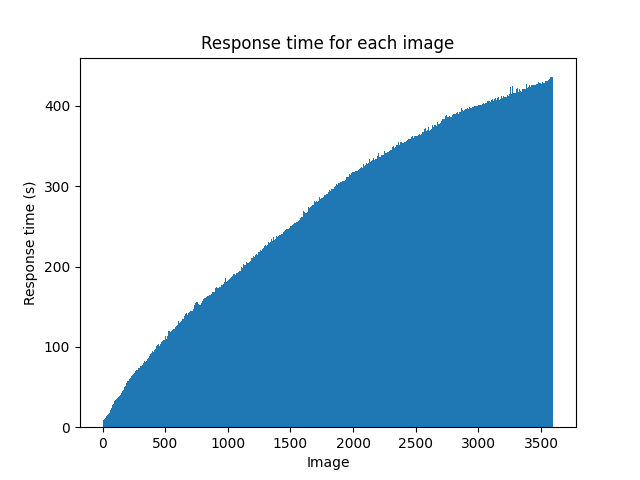

# Results

## Current ingestion status

### Scenario 1 - 150 images per second

Taking in 150 images/second with 50 requests/second containing batches of 3 images is sustainable ✅ 
Running for 30s caused no crashes or ingestion failure, leading to ingesting and processing 4.5k images successfully! 


* Maximum duration per image: 584s
* Minimum duration per image: 10s
* Average duration per image: 346s
* Number of images processed successfully: 4500

### Scenario 2 - 60 images per second

Taking in 60 images/second with 20 requests/second containing batches of 3 images is sustainable ✅ 
Running for 60s caused no crashes or ingestion failure, leading to ingesting and processing 3.6k images successfully! 



* Maximum duration per image: 438s
* Minimum duration per image: 7s
* Average duration per image: 269s
* Number of images processed successfully: 3600


# Replication

## Configuration

1. Install **Python > 3.9** (using [pyenv](https://github.com/pyenv/pyenv) is recommended)
2. Install poetry `pip install -U poetry`
3. Install project dependencies `poetry install`

Create an `.env` file with the following environment variables:

```
API_BASE_URL=https://api.neurolabs.ai
IR_TASK_UUID=...
API_KEY=...
BATCH_SIZE=3
NUM_REQUESTS_PER_SECOND=50
BENCHMARK_TIMING_IN_SECONDS=60
```

## Running the benchmark

Run benchmark with dashboard:

```bash
./k6 run --out 'dashboard=open' benchmark/constant_images_per_second.js
```

## Running the result processing

Run script to gather results:

```bash
python results/fetch_results.py
```

Processing time is plotted in the generated ```processing_time_plot.png```